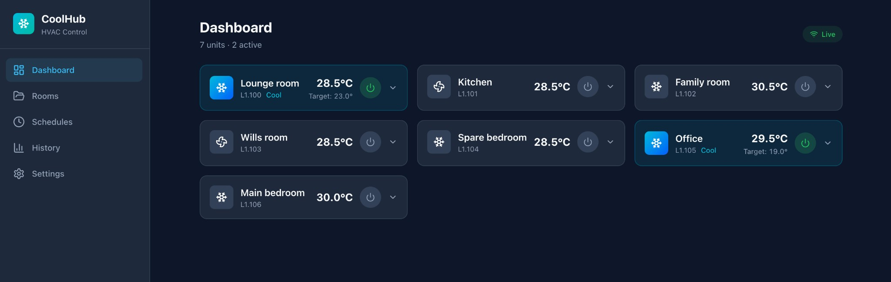
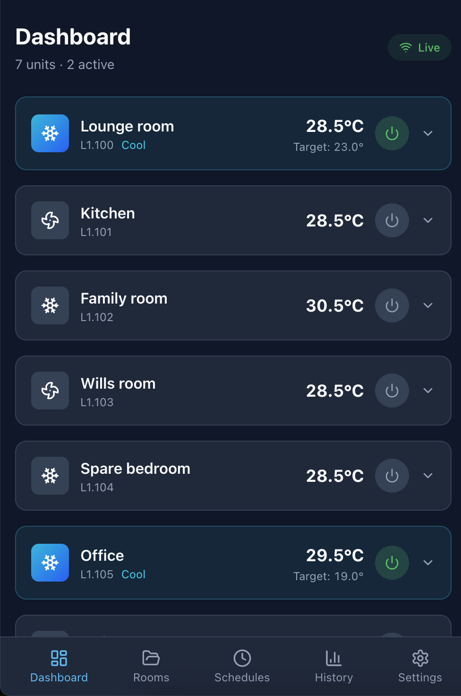
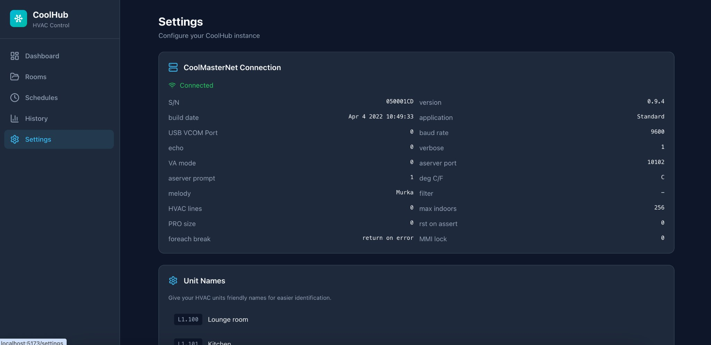

# CoolHub

A modern web dashboard and CLI for controlling [CoolMasterNet](https://coolautomation.com/products/coolmasternet/) HVAC systems over your local network.

<p>
  
</p>

## Features

- **Real-time dashboard** -- see all your HVAC units at a glance with live temperature, mode, and status updates via WebSocket
- **Full unit control** -- power on/off, mode (cool/heat/dry/fan/auto), target temperature, fan speed, and swing
- **Room grouping** -- organize units into rooms or zones with bulk power controls
- **Scheduling** -- create cron-based automations (e.g. "Weekdays 6am: heat bedroom to 22C")
- **Temperature history** -- track and chart temperature trends over time
- **Filter & error alerts** -- see which units need filter cleaning or have error codes
- **Custom naming** -- give friendly names to your units (e.g. L1.100 = "Lounge room")
- **CLI tool** -- control units from the terminal
- **Mobile friendly** -- fully responsive with bottom tab navigation, designed for use on phones

### Mobile

CoolHub is built mobile-first. The interface adapts to smaller screens with a bottom tab bar for navigation, full-width unit cards, and touch-friendly controls. Just open the server URL on your phone's browser -- no app install needed.

<p>
  
</p>

### Settings

View CoolMasterNet bridge info, connection status, and configure custom unit names.

<p>
  
</p>

## Prerequisites

- **Node.js** 20 or later
- **pnpm** 10 or later (`npm install -g pnpm`)
- A **CoolMasterNet** device on your local network

## Quick Start

```bash
# Clone the repo
git clone git@github.com:dougrathbone/coolhub.git
cd coolhub

# Install dependencies
pnpm install

# Configure your CoolMasterNet IP
cp .env.example .env
# Edit .env and set COOLMASTER_HOST to your device's IP address

# Build everything
pnpm build

# Start the server (serves both API and web UI)
pnpm start
```

Then open http://localhost:3000 in your browser.

## Development

```bash
# Run both the API server and Vite dev server with hot reload
pnpm dev
```

This starts:
- **Vite dev server** at http://localhost:5173 (with API proxy to the backend)
- **Fastify API server** at http://localhost:3000

## Configuration

All configuration is via environment variables. Copy `.env.example` to `.env` and edit:

| Variable | Default | Description |
|---|---|---|
| `COOLMASTER_HOST` | `192.168.1.100` | CoolMasterNet device IP address |
| `COOLMASTER_PORT` | `10102` | CoolMasterNet ASCII interface port |
| `COOLMASTER_SWING` | `false` | Enable swing/louvre control queries |
| `PORT` | `3000` | HTTP server port |
| `HOST` | `0.0.0.0` | HTTP server bind address |
| `POLL_INTERVAL_MS` | `10000` | How often to poll unit status (ms) |
| `HISTORY_INTERVAL_MS` | `300000` | How often to record temperature history (ms) |
| `DB_PATH` | `./coolhub.db` | SQLite database file path |

## CLI Usage

The CLI connects directly to the CoolMasterNet device (it does not require the server to be running).

```bash
# Show status of all units (alias: ls)
pnpm cli status

# Show a single unit's detailed status
pnpm cli status L1.100

# Turn a unit on or off
pnpm cli on L1.100
pnpm cli off L1.100

# Set temperature, mode, and/or fan speed in one command
pnpm cli set L1.100 --temp 22 --mode cool --fan med

# Show CoolMasterNet bridge system info
pnpm cli info

# Test connectivity to the CoolMasterNet device
pnpm cli ping

# Show CLI version
pnpm cli --version
```

### Global Options

| Flag | Default | Description |
|---|---|---|
| `-H, --host <host>` | `192.168.1.100` | CoolMasterNet device IP |
| `-p, --port <port>` | `10102` | CoolMasterNet ASCII interface port |

Example targeting a specific device:

```bash
pnpm cli -H 192.168.0.23 status
```

## Project Structure

```
packages/
  client/     @coolhub/client  - CoolMasterNet TCP client library
  server/     @coolhub/server  - Fastify API server + WebSocket + SQLite
  web/        @coolhub/web     - React + Vite + Tailwind CSS frontend
  cli/        @coolhub/cli     - Command-line interface
```

## License

MIT
